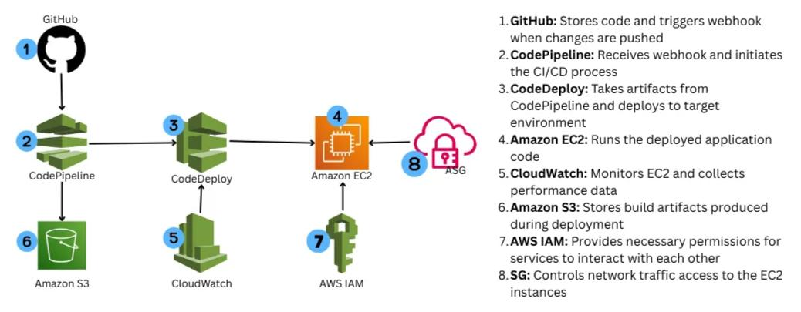

# GlobalMart CI/CD Pipeline (AWS)

## Project Purpose
The purpose of this project is to implement a real-world **CI/CD pipeline**
for an e-commerce application using AWS DevOps services and understand
automated deployment from GitHub to EC2.

---

## Project Overview
This project deploys a React-based e-commerce application on an AWS EC2
instance using **AWS CodePipeline** and **AWS CodeDeploy**.
Whenever code is pushed to GitHub, the pipeline automatically builds
and deploys the application to the EC2 server.

## CI/CD Architecture

## Tech Stack Used
- React.js
- GitHub
- AWS EC2
- AWS CodePipeline
- AWS CodeDeploy
- AWS S3
- AWS IAM
- AWS CloudWatch

## Architecture Flow
1. Developer pushes code to GitHub  
2. GitHub triggers AWS CodePipeline  
3. CodePipeline pulls source code  
4. Build stage executes Node.js commands  
5. Build artifacts are stored in Amazon S3  
6. AWS CodeDeploy deploys artifacts to EC2  
7. Application runs on EC2 (Apache/Nginx)  
8. CloudWatch monitors deployment and logs  

---

## What This Project Demonstrates
- End-to-end CI/CD pipeline implementation
- Automated deployment from GitHub to EC2
- Practical experience with AWS CodePipeline & CodeDeploy
- IAM role and permission handling
- Monitoring deployments using CloudWatch

---

## Screenshots / Proof
All pipeline execution, deployment success, EC2 status,
and application screenshots are available inside the
**screenshots/** folder.

---

GitHub: https://github.com/itzmayank01
gmail: mayankthakur9181@gmail.com

